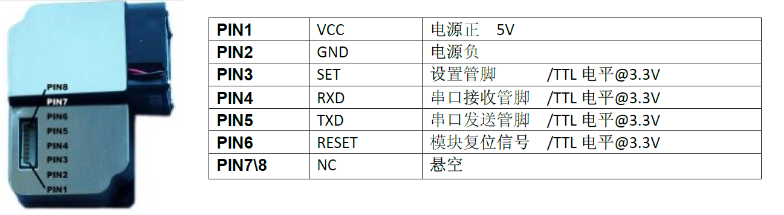
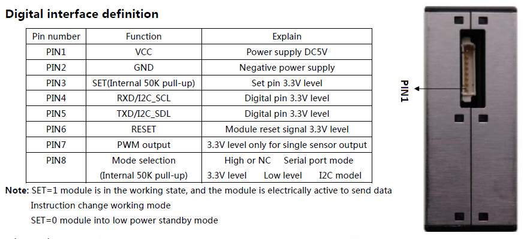
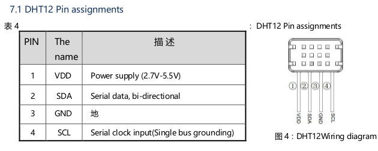

# AQmon Hardware

## Particulate Matter

The PMS3003 is a laser dust sensor by [Plantower][].
It reports PM1, PM2.5 and PM10 estimates from particle counts, under [Mie scattering][Mie] assumptions.

All sensors on the PMSx003 needs 5V to power the laser,
but communicate at 3.3V TTL via serial protocol.

[Plantower]: http://www.plantower.com
[Mie]: https://en.wikipedia.org/wiki/Mie_scattering#Atmospheric_science
[PMS3003]: ../Documents/PMS3003_LOGOELE.pdf
[PMS5003]: ../Documents/PMS5003_LOGOELE.pdf

### PMS1003, PMS3003 and PM5003

The PMS1003, [PMS3003][] and [PMS5003][] sensors use a 8 pin connector (Molex 1.25mm "PicoBlade" 51021 compatible, found online as 1.25mm JST).

### PMS7003 and PMSA003

The PMS7003 and PMSA003 sensors require a 10 pin connector (5x2 1.27mm female header).

## Temperature and Humidity

### DHT12

The [DHT12] sensor by [Aosong][], is inexpensive and small.
It reports temperature (deg C) and relative humidity (%) with 0.1 resolution
via I2C. With a Vcc range of 2.7 to 5.5V is well suited for 3.3V operations.

[Aosong]: http://aosong.com
[DHT12]: ../Documents/DHT12_Aosong.pdf

### BME280

The [BME280][] by [bosch-sensortec][] measures pressure, humidity and temperature.
It is a good quality sensor with plenty of libraries, and inexpensive breakout boards available.
Do not confuse with the cheaper [BMP280][], which only measures pressure and temperature.

The [BMP680][] is a more expensive version which also "measures air quality".
In addition to pressure, humidity and temperature, has a gas sensor.
The library provided by the manufacturer calculates an Air Quality Index (AQI) from all measurements.
Alas, the AQI calculation is hidden in a pre-compiled library,
so it is not possible to know what this value really means.

[bosch-sensortec]: https://www.bosch-sensortec.com
[BME280]: https://www.bosch-sensortec.com/bst/products/all_products/bme280
[BMP280]: https://www.bosch-sensortec.com/bst/products/all_products/bmp280
[BME680]: https://www.bosch-sensortec.com/bst/products/all_products/bme680

The current version of the firmware does not supports the BME280.
Support is planned for future versions, so footprints for a breakout board
is included on several of the AQmon boards currently in development.

## Boards

### ESP-01

The ESP-01 was the board that introduced the [ESP8266][] to the diy/maker community.
It needs a reliable 3.3V supply and provides 4 GPIO pins.
The original ESP-01 had only 512 KiB of flash memory.
On this project we need the more modern version with 1 MiB of flash.

[ESP8266]: https://en.wikipedia.org/wiki/ESP8266

### D1 mini

The [d1_mini][] board is the most popular ESP8266 board for weekend projects.
It comes with 4 MiB of flash and a CH340G USB to serial converter.
It is easy to program thanks to the builtin reset circuitry
and has enough memory for OTA updates.

[d1_mini]: https://wiki.wemos.cc/products:d1:d1_mini

### AQmon Boards

At the time of writing, 4 AQmon boards are in development.

The [AQmonV2-ESP01][] is a compact board for the ESP-01.
It has the 8 pin connector used by the PMS1003, PMS3003 and PMS5003,
and includes a footprint for the DHT12 and a 1.25mm 4 pin connector
for a different I2C sensor, such as the BME280.
Two boards with PMS3003 and DHT12 sensors, were successfully deployed with [v2.0.0-rc2][] firmware.

[v2.0.0-rc2]: https://github.com/avaldebe/AQmon/releases/tag/v2.0.0-rc2

The [AQmonV2-USB][] board can be used to safely connect any of the PMSx003 sensor to a host computer via USB. The sensor data is easily read with a Python script. **This board is currently being manufactured, the Python script will be included when the board is fully tested**. 
This board provides 2 modules:

- ``USB adapter module``: 3.3V UART to USB converter   with 8 pin connector.
- ``Break out module``: expose sensors pins into a 6 pin 2.54mm header,
  from the 8 pin or 10 pin connectors.

The other 2 boards under development are for the [d1_mini][].
One is a shield with connectors for the PMS3003/PMS5003 and BME280.
The other is a base plate for a 5x7 cm2 case, with footprints for
PMS3003/PMS5003 or PMS7003/PMSA003 sensors.

[AQmonV2-ESP01]: https://easyeda.com/avaldebe/AQmonV2-ESP01
[AQmonV2-USB]:   https://easyeda.com/avaldebe/aqmonv2-usb
[AQmonV2-D1mini]:https://easyeda.com/avaldebe/aqmonv2-d1mini
[AQmonV2-base]:  https://easyeda.com/avaldebe/aqmonv2
